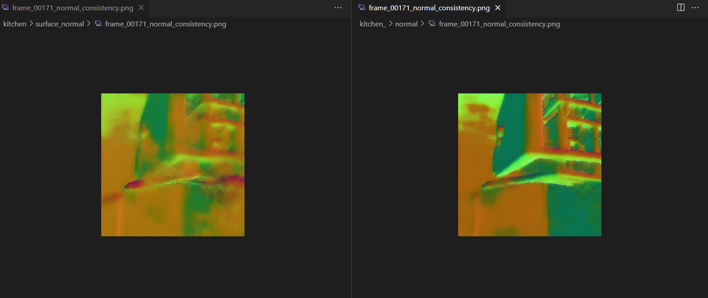

Hello! I am a senior undergraduate student from South China University of Technology, advised by Prof.[Chuhua Xian](https://chuhuaxian.github.io/index.html). And I am working as an internship at Institute for AI Industry Research of Tsinghua University, advised by post-doc [Zike Yan](https://zikeyan.github.io/).

**`Sincerely looking for phD positions for fall 2025 admission!`**

Internships&Research Experience
======
Here are some of the phased results of the experience.

Super Robot Research Institute
------
**Flexible-rigid hybrid mechanical claw**

**Biped robot**

<iframe src="/assets/biped.mp4" width="640" height="360" frameborder="0" allowfullscreen></iframe>

Institute for AI Industry Research,Tsinghua University
------

1.Build a continual learning framework based on the trained nerf

2.Add new properties to the framework
Taking normal as an example.

Adversarial graph contrast learning method based on asymmetric contrast loss
------

